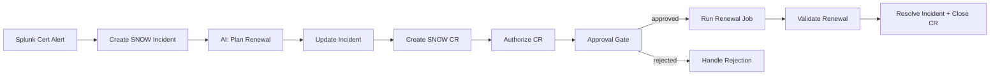

# Intelligent Cert Rotation

AI-driven certificate renewal — an Automation Orchestrator workflow where Splunk detects near-expiry certs, ServiceNow tracks the incident/CR lifecycle, an AI agent picks the correct renewal strategy (PEM vs Java keystore), an operator approves via ServiceNow, and AAP renews and validates TLS automatically.

## What This Demo Shows

Two certificates expire on production services at the same time. A cron-based monitoring script feeds cert status into Splunk, which fires a webhook alert to Automation Orchestrator when certs are within 7 days of expiry. The AO workflow:

1. Creates a ServiceNow incident for the cert expiry
2. Runs an AI agent that analyzes each certificate, discovers available AAP job templates via MCP, and selects the correct renewal strategy
3. Updates the SNOW incident with the AI analysis and confidence score
4. Creates and authorizes a SNOW Change Request for operator approval
5. Waits for CR approval (EDA bridges SNOW approval to AO gate)
6. Executes the correct renewal job (PEM for nginx, Java keystore for API server)
7. Validates the new certificate via OpenSSL TLS handshake
8. Resolves the SNOW incident and closes the CR

## Workflow



## Docs

| Document | Purpose |
|---|---|
| [SETUP_GUIDE.md](SETUP_GUIDE.md) | Step-by-step environment setup |
| [REQUIREMENTS.md](REQUIREMENTS.md) | Prerequisites and infrastructure |
| [DEMO_SCRIPT.md](DEMO_SCRIPT.md) | Live demo narration script |

## Import Workflow

- Manual trigger: [`ao/cert-demo-manual.json`](ao/cert-demo-manual.json)
- Webhook trigger: [`ao/cert-demo-webhook.json`](ao/cert-demo-webhook.json)

## Playbooks

| Playbook | What It Does | Runs On |
|---|---|---|
| [`renew_certificate.yml`](playbooks/renew_certificate.yml) | Pulls a new PEM cert from Vault CA, installs for nginx, reloads | RHEL node (nginx / PEM) |
| [`renew_keystore_certificate.yml`](playbooks/renew_keystore_certificate.yml) | Renews a Java keystore cert, updates keystore, restarts Tomcat | RHEL node (Java keystore) |
| [`validate_certificate.yml`](playbooks/validate_certificate.yml) | OpenSSL TLS handshake check — reports subject, issuer, expiry | RHEL node |
| [`manage_snow_incident.yml`](playbooks/manage_snow_incident.yml) | SNOW incident lifecycle: create, update, resolve | localhost |
| [`manage_snow_change_request.yml`](playbooks/manage_snow_change_request.yml) | SNOW CR lifecycle: create, authorize, update, review, close | localhost |
| [`bridge_ao_approval.yml`](playbooks/bridge_ao_approval.yml) | Bridges SNOW CR approval to AO approval gate | localhost |
| [`trigger_ao_workflow.yml`](playbooks/trigger_ao_workflow.yml) | EDA-to-AO bridge for webhook triggers | localhost |
| [`manage_git_repo.yml`](playbooks/manage_git_repo.yml) | GitHub operations: commit files, create PRs | localhost |

## Quick Start

```bash
# 1. Clone and configure
git clone <this-repo> ao-cert-rotation
cd ao-cert-rotation
cp .env.example .env
# Fill in .env with your credentials

# 2. Build container images
./dependencies/build-images.sh --push

# 3. Provision infrastructure
cd setup/terraform && terraform apply && cd ../..

# 4. Setup demo host (nginx + Vault + Tomcat + Splunk)
./setup/scripts/setup-apply.sh

# 5. Apply AAP Configuration as Code
./ansible_deployment/scripts/cac-apply.sh

# 6. Import AO workflow, configure AI credential, publish
# 7. Update .env with AO webhook creds, re-run cac-apply.sh
# 8. Reset certs to trigger the demo
ansible-playbook -i setup/playbooks/inventory/hosts.yml \
  setup/playbooks/generate_expired_cert.yml
```

See [SETUP_GUIDE.md](SETUP_GUIDE.md) for detailed instructions.

## Ports Reference

| Service | Port | Purpose |
|---|---|---|
| nginx | 443 | PEM cert service |
| API server (Tomcat) | 8443 | Java keystore cert service |
| Vault | 8200 | HashiCorp Vault (CA) |
| Splunk UI | 8000 | Splunk web interface |
| Splunk HEC | 8088 | HTTP Event Collector |
| Splunk Mgmt | 8089 | Management API |
