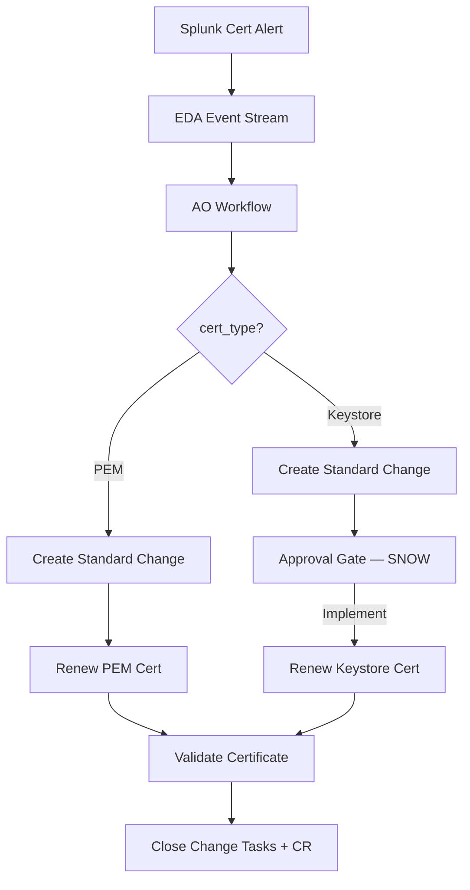

# Certificate Rotation Demo

Deterministic certificate renewal powered by Ansible Automation Platform, Automation Orchestrator, and ServiceNow. Splunk detects near-expiry certs, EDA triggers an AO workflow that creates an ITIL-correct standard change, renews the certificate via HashiCorp Vault, validates it, and closes the change request — with full audit trail.

**No AI involved.** This demo deliberately uses pure deterministic automation — when the process is well-defined, you don't need AI.

## What This Demo Shows

Two certificate types on production services, each handled differently:

- **PEM (nginx)** — zero-downtime reload, fully automated end-to-end
- **Java Keystore (Tomcat)** — requires restart, so the workflow pauses for human approval in ServiceNow

The AO workflow:

1. Creates a ServiceNow **standard change** from a template, linked to the CMDB CI
2. Renews the certificate via HashiCorp Vault PKI
3. Validates the new certificate via OpenSSL TLS handshake
4. Closes the change tasks with AAP job links, then closes the CR

For keystore renewals, step 2 is gated — an operator must move the CR to "Implement" in ServiceNow (acknowledging the restart/downtime). EDA detects this and resumes the workflow automatically.

## Workflow



## Demo Commands

```bash
# Full reset (renew certs to 90 days, clean Splunk, clear SNOW)
./scripts/demo-reset.sh

# Shorten cert life to ~5 days
./scripts/shorten-pem-cert.sh           # nginx PEM
./scripts/shorten-keystore-cert.sh      # Tomcat keystore

# Trigger AO workflow via EDA
./scripts/test-trigger.sh               # PEM
./scripts/test-trigger.sh keystore      # Keystore

# SSH to demo VM
ssh -i setup/terraform/demo-key.pem ec2-user@63.32.42.56

# Check certs from the VM
echo | openssl s_client -connect localhost:443 -servername certdemo.demoredhat.com 2>/dev/null | openssl x509 -noout -subject -enddate
echo | openssl s_client -connect localhost:8443 -servername certdemo.demoredhat.com 2>/dev/null | openssl x509 -noout -subject -enddate

# Splunk search
index=main sourcetype=cert_monitor | table _time service cert_type days_remaining status
```

## Docs

| Document | Purpose |
|---|---|
| [SETUP_GUIDE.md](SETUP_GUIDE.md) | Step-by-step environment setup |
| [REQUIREMENTS.md](REQUIREMENTS.md) | Prerequisites and infrastructure |
| [DEMO_SCRIPT.md](DEMO_SCRIPT.md) | Live demo narration script |

## AO Workflows

| Workflow | Trigger |
|---|---|
| [`ao/cert-demo-webhook.json`](ao/cert-demo-webhook.json) | EDA / webhook trigger (primary) |
| [`ao/cert-demo-manual.json`](ao/cert-demo-manual.json) | Manual trigger (testing) |

## Playbooks

| Playbook | What It Does | Runs On |
|---|---|---|
| [`renew_certificate.yml`](playbooks/renew_certificate.yml) | PEM cert from Vault, install for nginx, reload | Demo VM |
| [`renew_keystore_certificate.yml`](playbooks/renew_keystore_certificate.yml) | Vault → PKCS12 → JKS conversion, Tomcat restart | Demo VM |
| [`validate_certificate.yml`](playbooks/validate_certificate.yml) | OpenSSL TLS handshake check | Demo VM |
| [`manage_snow_change_request.yml`](playbooks/manage_snow_change_request.yml) | Standard change lifecycle: create, schedule, close | localhost |
| [`trigger_ao_workflow.yml`](playbooks/trigger_ao_workflow.yml) | EDA-to-AO bridge for webhook triggers | localhost |
| [`bridge_ao_approval.yml`](playbooks/bridge_ao_approval.yml) | Bridges SNOW CR approval to AO approval gate | localhost |

## Quick Start

```bash
# 1. Clone and configure
git clone <this-repo> ao-cert-rotation
cd ao-cert-rotation
cp .env.example .env
# Fill in .env with your credentials

# 2. Provision infrastructure
cd setup/terraform && terraform apply && cd ../..

# 3. Setup demo host (nginx + Vault + Tomcat + Splunk)
./setup/scripts/setup-apply.sh

# 4. Apply AAP Configuration as Code
./ansible_deployment/scripts/cac-apply.sh

# 5. Import AO workflow + publish
# 6. Reset and run the demo
./scripts/demo-reset.sh
./scripts/shorten-pem-cert.sh
# Wait ~2 min for Splunk alert, then trigger:
./scripts/test-trigger.sh
```

See [SETUP_GUIDE.md](SETUP_GUIDE.md) for detailed instructions.

## Ports Reference

| Service | Port | Purpose |
|---|---|---|
| nginx | 443 | PEM cert service (citizen portal) |
| Tomcat | 8443 | Java keystore cert service (API) |
| Vault | 8200 | HashiCorp Vault PKI (certificate authority) |
| Splunk UI | 8000 | Splunk web interface |
| Splunk HEC | 8088 | HTTP Event Collector |
| Splunk Mgmt | 8089 | Management API |

## Why No AI?

This is one of three demos (alongside CVE remediation and AIOps ticket enrichment). The cert rotation demo deliberately uses **no AI** to make the point that pure deterministic automation is the right tool when the process is well-defined. Not every problem needs an LLM — sometimes a switch node is all you need.
